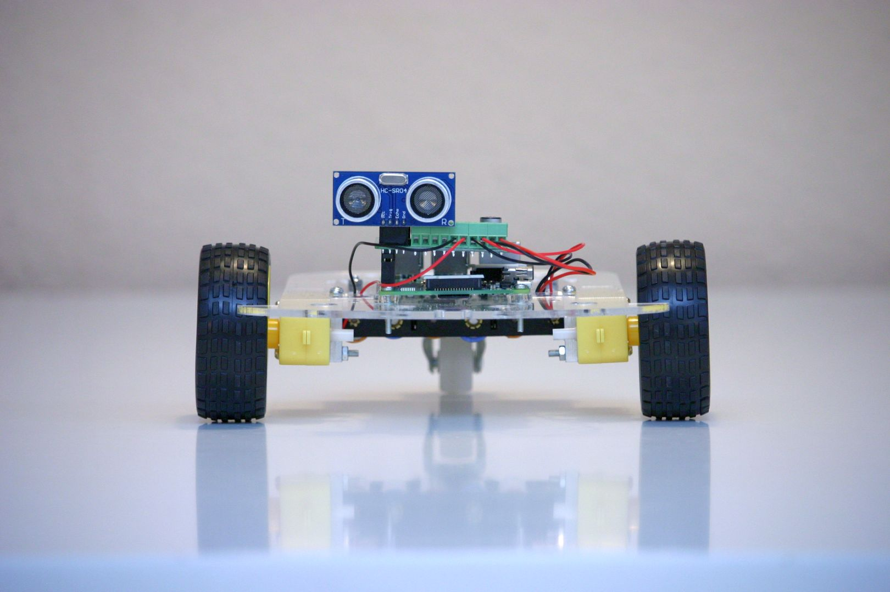

* [Über das Projekt](project)
* Kurse
  * [Bau des Roboters](hardware)
  * Basisinstallation Software (TODO)
  * Programmieren mit Scratch (TODO)
    * [Scratch Erweiterung](https://github.com/markokimpel/rrbscratchextension) für RasPiRobot Board
