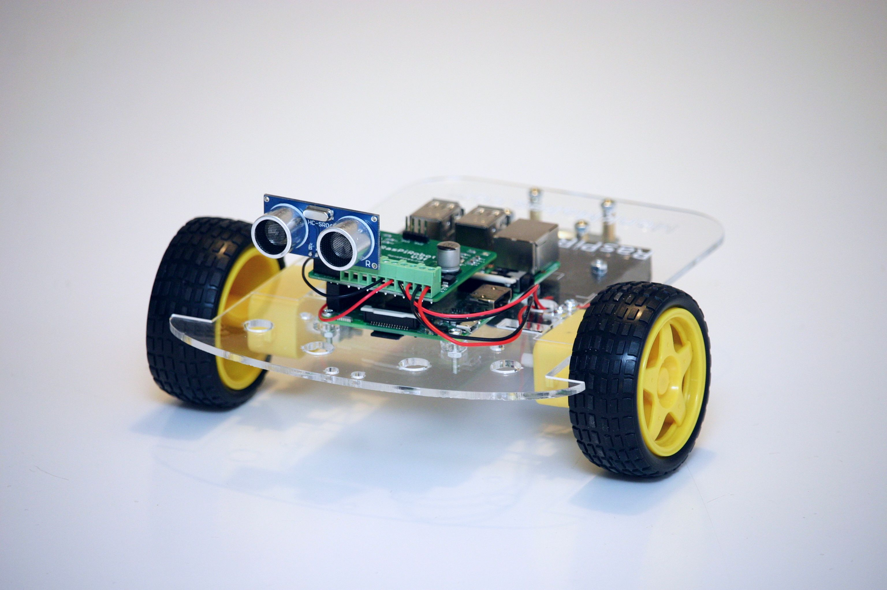
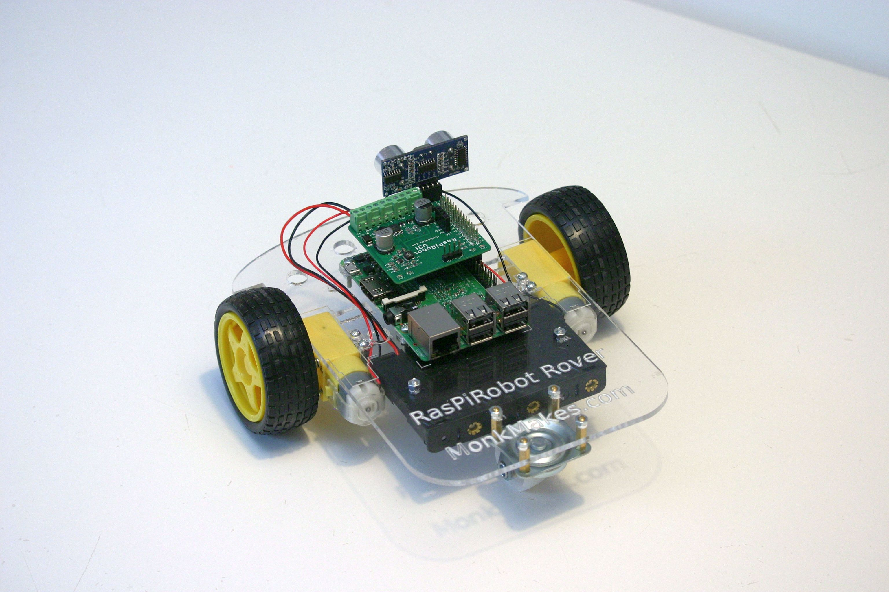
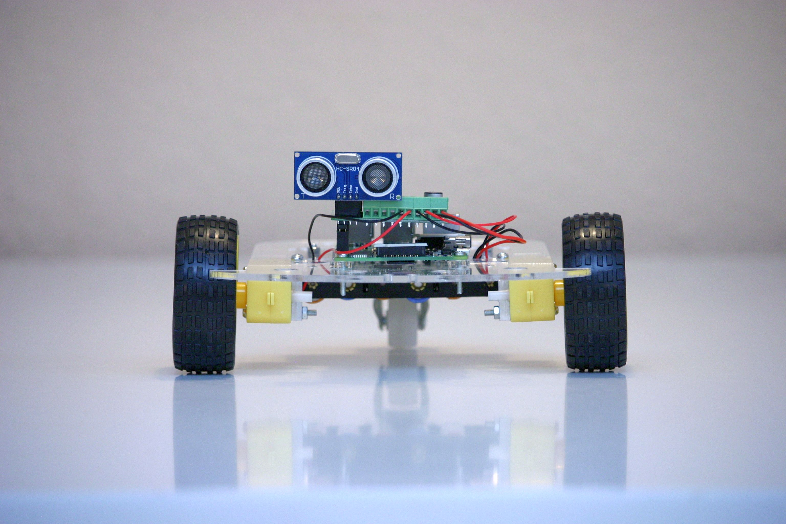
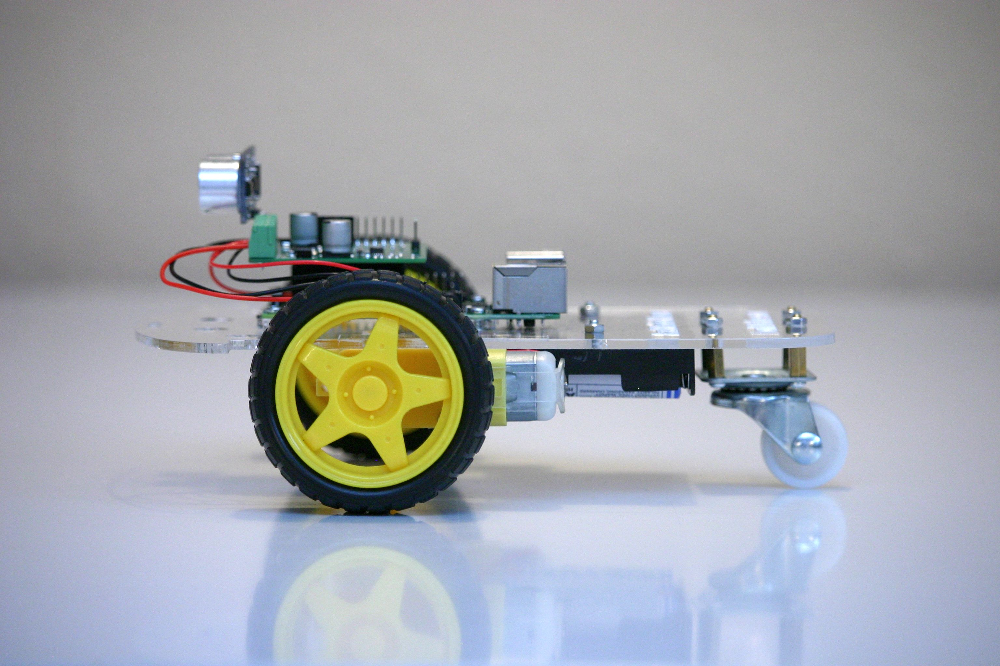
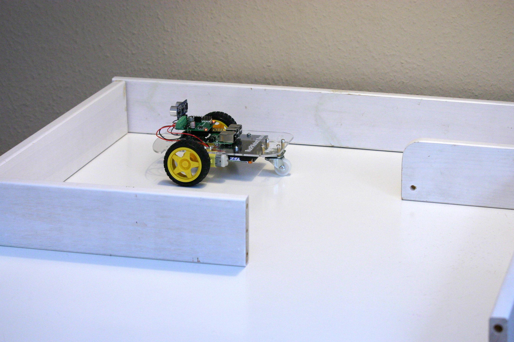

[Hardware](..)

# Version 0

Version 0 ist unser erster Wurf. Er basiert auf dem [RasPiRobot Rover Kit](https://www.monkmakes.com/pi-rover/) von [Monk Makes](https://www.monkmakes.com/). Dieses Kit hatte eine gute sehr gute [Kritik](https://www.raspberrypi.org/magpi/raspirobot-rover-kit-review/) vom MagPi Magazine bekommen.

## Komponenten

Wir wählten folgende Komponenten:

Komponente | Bezug / Preis
-----------|------------
[Raspberry Pi 3 Model B](https://www.raspberrypi.org/products/raspberry-pi-3-model-b/) | [Amazon](https://www.amazon.de/gp/product/B01CD5VC92/) (ca. 35 €)
[Raspberry Pi Netzteil](https://www.raspberrypi.org/products/raspberry-pi-universal-power-supply/) | [Amazon](https://www.amazon.de/Raspberry-Offizielles-Pi-Netzteil-schwarz/dp/B01DP8O5A4/) (ca. 13 €)
32 GB microSD Karte mit Adapter | [Amazon](https://www.amazon.de/gp/product/B073JWXGNT/) (ca. 17 €)
[RasPiRobot Rover Kit](https://www.monkmakes.com/pi-rover/) | [Amazon](https://www.amazon.de/gp/product/B018Y8IMUE/) (ca. 51 €)
6 AA Ni-MH Akkus mit hoher Kapazität | [Amazon](https://www.amazon.de/gp/product/B00JVV8HRW/) (2x ca. 12 €)
Ladegerät für AA Ni-MH Akkus | bereits vorhanden
**Gesamt** | **ca. 140 €**

PS: Die Auswahl der Komponenten basiert auf persönlichen Erfahrungen und Präferenzen. Bezugsquellen und Preise werden nur beispielhaft angegeben. Wir haben von keinem Hersteller oder Händler Vergünstigungen - jeglicher Art - für die Auswahl oder das Verlinken der Produkte erhalten.

## Kritik

### Gut

* Alles funktioniert!
* Das RasPiRobot Rover Kit ist recht umfangreich. Alle benötigten Teile - inkl. Schraubendreher in verschiedenen Größen - liegen bei. Der Zusammenbau per Anleitung ist gut möglich, wenn auch manchmal ein bisschen friemelig. Hilfe von Erwachsenen ist zwingend erforderlich.
* Das Driver Board [RasPiRobot Board V3](https://www.monkmakes.com/rrb3/) liegt dem RasPiRobot Rover Kit bei.
  * Die Stromversorgung des Raspberries erfolgt bei Batteriebetrieb über das Driver Board. Die gleiche Stromquelle (6x AA Batterien oder Akkus) kann für Raspberry (5V) und die Motoren (6V) genutzt werden.
  * Die beiden Motoren (rechts/links) werden über das Driver Board angesteuert. Jeweils sind vorwärts/rückwärts und verschiedene Geschwindigkeiten über PWM möglich.
  * Das Driver Board hat zusätzlich Anschlüsse für einen Ultraschall-Sensor (Sensor liegt dem Kit bei), zwei Schalter (eine Schalter liegt bei) und zwei Open Collector Ausgänge. Zwei LEDs sind verbaut und können über GPIO PINs angesprochen werden.
  * Das Glimmen der verbauten LEDs zeigt an, dass Raspi und Driver Board mit Batterie-Strom versorgt werden. (Da die rote LED des Raspis nur bei USB Strom leuchtet wüsste man sonst nicht, ob der Raspi mit Strom versorgt wird oder nicht.)
  * Beispielcode zum Ansteuern des verwendeten Driver Boards [RasPiRobot Board V3](https://www.monkmakes.com/rrb3/) mit Python liegt vor. Integration mit Scratch2 mit selbstgeschriebenem Code war möglich.
* Laufzeit mit Batterie/Akku ausreichend (mehrere Stunden).

### Verbessern

Bitte diese Kritikpunkte nicht als direkte Kritik am RasPiRobot Rover Kit misverstehen. Das Kit ist für verschiedene Nutzergruppen gedacht und die haben unterschiedliche Anforderungen. Hier geht es um Verbesserungen für den Schüler-Roboter.

* Ist der Raspi mit dem Chassis verschraubt, kommt man an viele Raspi Anschlüsse nur noch schwer ran: USB Stromversorgung - nur mit großer Vorsicht und kurzem Stecker, HDMI - nicht möglich, microSD Karte - schwierig und nur mit Hilfsmittel.
* Das Driver Board wird nur über die GPIO Kontakte des Raspis befestigt, d.h. an nur einer Seite. Schon leichte Stösse können die Kontakte beschädigen. 
* Dem Kit liegt ein Netzschalter bei. Um ihn zu benutzen müsste man aber löten. Alternativ wird der Raspi durch das Entfernen einer Batterie stromlos geschaltet. Funktioniert, ist aber nicht elegant. (Wohin legt man die verbleibende Batterie?)
* Häufig kam es zu Wackelkontakten im Batteriehalter. Die Suche nach dem Wackelkontakt war dann sehr schwierig. Ursache ist wahrscheinlich die Befestigung mit Schrauben. Die Schraubenköpfe sorgen bei der ersten und letzten Batterie für einen lockeren Sitz.
* Die Batterien/Akkus können nur schwer von Kindern eingelegt werden. Das Batterienfach befindet sich auf der Unterseite. Der Roboter kann nicht auf seine Oberseite gelegt werden - dann würden Ultraschall-Sensor oder Driver Board verbiegen. Kinder können den Roboter nicht in einer Hand halten und wenden - aufgrund seiner Größe müssten sie ihn an nur einer Ecke festhalten und dafür ist er zu schwer.
* Batterien waren für uns aufgrund des entstehenden Abfalls keine Option. Die 6 Ni-MH Akkus konnten jedoch nicht wirklich überzeugen. Ihre Kapazität 6x min. 2500mAh (bei 1,2V) war für den Betrieb völlig ausreichend. Die Ladezeit ist jedoch sehr lang: die meisten Ladegeräte können maximal 4 Akkus gleichzeitig laden. D.h. man benötigt zwei Durchläufe um 6 Akkus zu laden. Praktisch wird man sich ein zweites Pack an Akkus zulegen.
* Da es keine Ladestandsanzeige gibt, kann der Moment, an dem der Raspi plötzlich abstürzt nicht vorausgesagt werden. Ärgerlich, wenn man länger nicht gespeichert hat.

## Fotos

