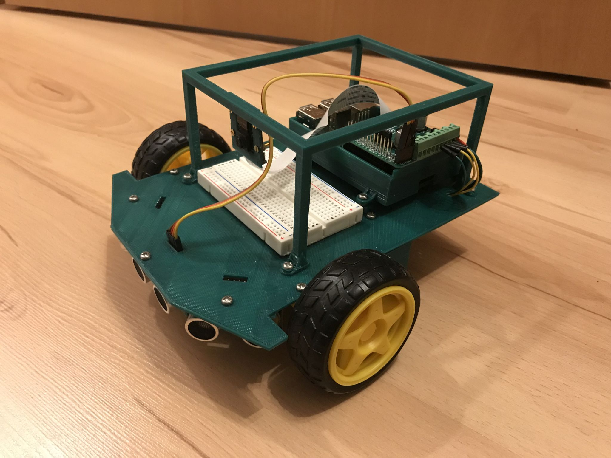
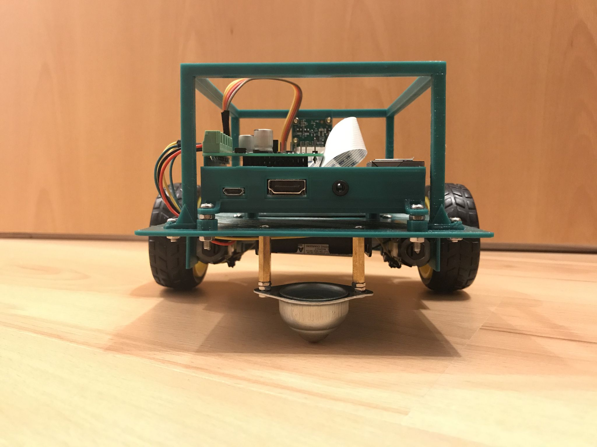

[Hardware](..)

# Version 1

Version 1 nutzt ein selbstgedrucktes Chassis. Hierfür konnten wir freundlicherweise einen 3D Drucker der [Lichtwerkstatt](http://www.acp.uni-jena.de/lichtwerkstatt.html) des Abbe Center of Photonics nutzen. Es wird das gleiche Driver Board wie bei [Version 0](../version0/) verwendet. Die meisten der Kritikpunkte der Version 0 wurden durch die Eigenkonstruktion beseitigt. Zusätzlich wurde eine Kamera vorgesehen.

## Komponenten

Wir wählten folgende Komponenten:

Komponente | Bezug / Preis
-----------|------------
[Raspberry Pi 3 Model B](https://www.raspberrypi.org/products/raspberry-pi-3-model-b/) | [Amazon](https://www.amazon.de/gp/product/B01CD5VC92/) (ca. 35 €)
[Raspberry Pi Netzteil](https://www.raspberrypi.org/products/raspberry-pi-universal-power-supply/) | [Amazon](https://www.amazon.de/Raspberry-Offizielles-Pi-Netzteil-schwarz/dp/B01DP8O5A4/) (ca. 13 €)
32 GB microSD Karte mit Adapter (Kompatibilität mit Raspberry Pi beachten) | [Amazon](https://www.amazon.de/gp/product/B073JWXGNT/) (ca. 17 €)
[RapPiRobot Board V3](https://www.monkmakes.com/rrb3/) | (TODO)
[Raspberry Kamera](https://www.raspberrypi.org/products/camera-module-v2/) | (TODO)
2 Motoren und Räder | (TODO)
Nachlaufrad | (TODO)
2 Hülsen | (TODO)
3 Ultraschallsensoren | (TODO)
Steckbrett 400 Kontakte | (TODO)
Schrauben und Muttern | (TODO)
verschiedene Kabel | (TODO)
Batteriehalterung | (TODO)
6 AA Ni-MH Akkus mit hoher Kapazität | [Amazon](https://www.amazon.de/gp/product/B00JVV8HRW/) (2x ca. 12 €)
Ladegerät für AA Ni-MH Akkus | bereits vorhanden
**Gesamt** | **(TODO)**

PS: Die Auswahl der Komponenten basiert auf persönlichen Erfahrungen und Präferenzen. Bezugsquellen und Preise werden nur beispielhaft angegeben. Wir haben von keinem Hersteller oder Händler Vergünstigungen - jeglicher Art - für die Auswahl oder das Verlinken der Produkte erhalten.

## 3D Modell

* [Hauptplatte](3d_model/SR1%20Base%20Plate%20Rev%203.stl)
* [Raspberryhalterung](3d_model/SR1%20Raspberry%20Socket%20Rev%203.stl) (basiert auf [Raspberry Pi Case - HifiBerry Dac+](https://www.thingiverse.com/thing:2325301) von B_Dubb, veröffentlicht am 16. May 2017)
* [Abstandshalter Raspberryhalterung](3d_model/SR1%20Raspberry%20Socket%20Spacers%20Rev%201.stl)
* [Motorhalterung rechts](3d_model/SR1%20Motor%20Bracket%20R%20Rev%204.stl)
* [Motorhalterung links](3d_model/SR1%20Motor%20Bracket%20L%20Rev%204.stl)
* [Ultraschallsensorhalterung](3d_model/SR1%20Sonar%20Bracket%20Rev%202.stl) (3x benötigt)
* [Käfig mit Kamerahalterung](3d_model/SR1%20Cage%20Rev%200.stl)

## Fotos

