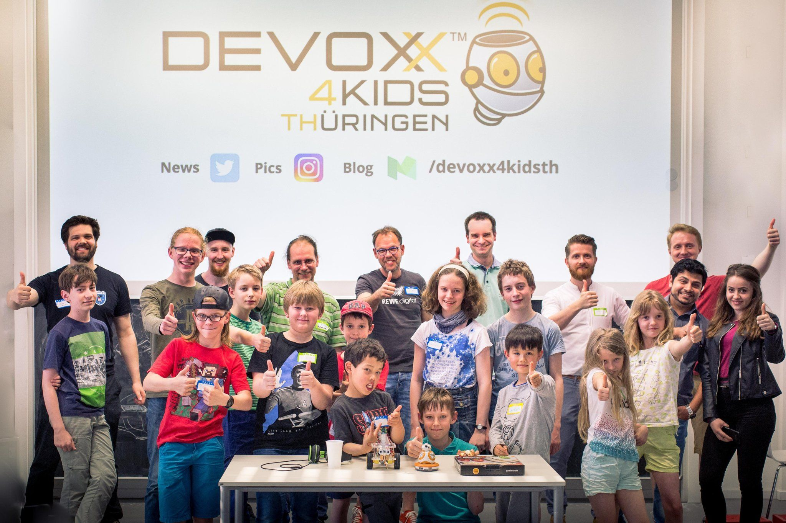
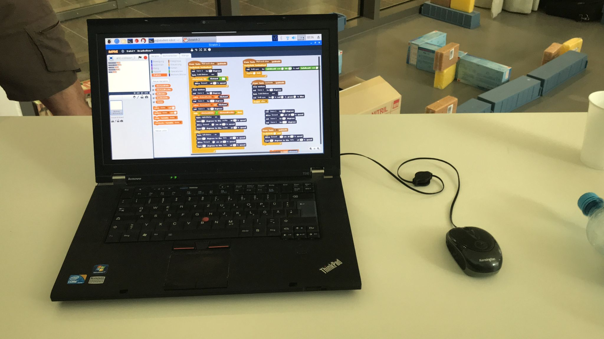

Der Schüler-Roboter war auf der [ersten Devoxx4Kids Thüringen Veranstaltung](https://www.meetup.com/jugthde/events/250002237/).

Foto: [Devoxx4Kids Thüringen](https://twitter.com/Devoxx4KidsTh/status/987843731784175616)

Schüler haben ein Scratch Programm geschrieben, dass den Roboter voll autonom durch ein Labyrinth fahren lässt.

Video: Robi im Labyrinth
