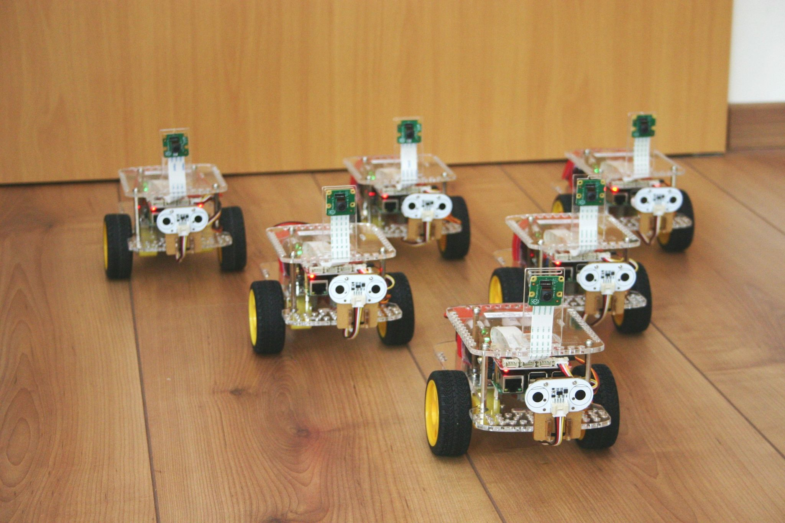

[Home](../..) - [News](README.md)

# 10-Sep-2018 Ein Klassensatz Schüler-Roboter

Dank der [Lichtwerkstatt](https://lichtwerkstatt-jena.de/) steht uns ein Klassensatz Schüler-Roboter zur Verfügung. Fertig zusammengebaut, mit dem neuesten Raspbian, Scratch, Python und OpenCV. Es kann los gehen!

