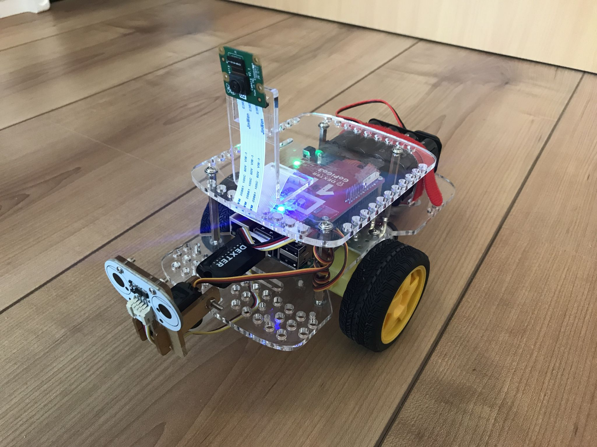

## Vision

Schaffung einer offenen und leistungsstarken Plattform auf der Schüler jeden Alters mit Freunde Computerkenntnisse erwerben können.

## Der Schüler-Roboter ist ein fahrbarer Roboter auf Basis des Raspberry Pis

[Physical Computing](https://de.wikipedia.org/wiki/Physical_Computing) macht einfach mehr Spaß als das trockene Programmieren am Computer. Wir Menschen können leichter eine Verbindnung zu physischen Objekten aufbauen als zu abstrakten Aufgabenstellungen. Zielstellungen wie *Ding beweg dich* oder *mach' dies und das* ergeben sich bei physischen Objekten natürlich, ohne dass es einer zusätzlichen Motivation bedarf. Ein **selbstfahrender Roboter** erscheint hier als ideale Hardwarebasis.

Ein Raspberry Pi ist das Herzstück des Roboters. Der [Raspberry Pi 3 Model B](https://www.raspberrypi.org/products/raspberry-pi-3-model-b/) der Raspberry Pi Foundation ist ein leistungsstarker und kostengünstiger Einplatinenrechner. Seine offene Architektur erlaubt es verschiedene Betriebssysteme und Softwarepakete auf ihm laufen zu lassen und ihn mit verschiedenster Hardware zu integrieren. Seine große Beliebtheit im akademischen und Hobbybereich hat zu einer sehr aktiven Community und einem umfangreichen Angebot an Erweiterungen und Anleitungen geführt. Wir wählten den Raspberry Pi 3 Model B, da er ein **sehr breites Spektrum von Anwendungen** ermöglicht - von der Ansteuerung einzelner Komponenten (Motor an/aus), über die Programmierung mit Standardprogrammiersprachen wie Python, JavaScript und Java, die Nutzung von Roboterbetriebssystemen, bis zur Bilderkennung und künstlichen Intelligenz.

Als Hardwarebasis für den Roboter wird der [GoPiGo3](https://www.dexterindustries.com/gopigo3/) genutzt. Der GoPiGo3 ist einer der besten Roboter-Bausätze für den Raspberry Pi. Er enthält das Fahrgestell, die Motoren, Räder, die Steuerplatine, Stromversorgung, etc. Ein schwenkbarer Abstandssensor und eine leistungsstarke Kamera runden das Hardwarepaket ab.

## Ein sicherer Pfad durch den Jungle

Das umfangreiche und teilweise unübersichtliche Angebot an Komponenten und Software rund um den Raspberry Pi macht es dem Einsteiger bisweilen schwer geeignete und zueinander passende Komponenten auszuwählen und in ersten eigenen Projekten zu nutzen. Diese Hürde wird durch die **genaue Vorgabe von Komponenten** und **detailierten Anweisungen** genommen. Mit diesen erreichst du - mit Hilfe eines Kursleiters, Lehrers oder deiner Eltern - sicher das Ziel einen programmierbaren Roboters zu erschaffen. Die Programmierkurse sind auf diese Hardwarekomponenten abgestimmt. Von dem vorgegebenen Modell ausgehend können eigene Umbauten und Erweiterungen vorgenommen werden. Die Vielzahl der Projekte in der Community laden geradezu dazu ein.

## Einfach bis Rocket Science

Der Schüler-Roboter hat für jeden Schwierigkeitsgrad was zu bieten. Er eignet sich für Einsteiger, z.B. zum Erlernen der Programmierung mit der graphischen Programmiersprache Scratch. Er kann zum Erlernen von textuellen Programmiersprachen, wie z.B. Python, genutzt werden. Oder man taucht ein in die Bilderkennung und künstliche Intelligenz und lässt die neuesten Algorithmen auf ihm laufen.

## Alleine lernen oder in der Gruppe

Gerne kannst du dich allein durch die Anleitungen arbeiten. Oder du kommst du einer Veranstaltung. Interesse an einer massgeschneiderten Veranstaltung, z.B. für eine Schule? Bitte nehmen Sie [Kontakt](../contact/) mit uns auf.
