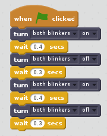
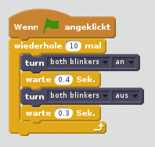
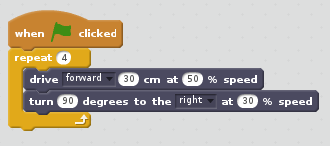
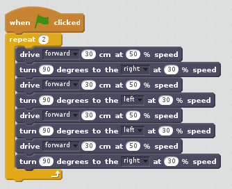
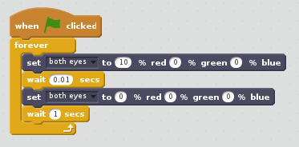
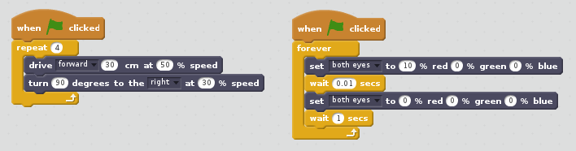

[Home](../..)

# Programmieren mit Scratch

## Voraussetzungen

* Roboter mit aktuellen Software (siehe [Bau des Roboters](../build_a_robot))
* Einen weiteren Computer um auf den Roboter zuzugreifen. An diesem Computer sitzt du und programmierst den Roboter. Der Computer kann ein Raspberry Pi mit Monitor, Tastatur und Maus sein, oder ein Windows Laptop. Da der Roboter über WLAN kommuniziert, muss auch der weitere Computer über WLAN kommunizieren können.

## Mit dem Roboter verbinden

* Anschalten
  * Starte den Roboter indem du die Power Taste (rechts hinten am GoPiGo3 Board) drückst. Die grüne LED daneben beginnt zu blinken. Das bedeutet, das Betriebssystem wird geladen. Wenn die LED ständig grün leuchtet ist der Roboter betriebsbereit.
  * Übrigens: Wenn die LED neben der Power Taste beginnt gelb oder gar violett zu leuchten, dann bedeutet das die Akkus sind fast leer. Dann den Roboter ausschalten und Akkus wechseln.
* Mit WLAN verbinden
  * Der Roboter bietet ein WLAN Netzwerk an. Der Netzwerkname (SSID) ist *student-robot*, bei Arbeitsgruppen *student-robot[zahl]*. Das voreingestellte Passwort ist *changeitnow*. Bei Arbeitsgruppen erfrage das Passwort von deinem Gruppenleiter.
  * Verbinde dich mit deinem Arbeitsrechner zum WLAN des Roboters. Wennn du dich mit dem Roboter WLAN verbindest, verlierst du eine evtl. vorher bestehende WLAN Verbindung zum lokalen WLAN Router und damit zum Internet.
* Mit VNC Viewer verbinden
  * Mit dem VNC Viewer verbindest du dich zum Roboter und kannst den Desktop des Roboters sehen.
  * Bei Raspbian ist der VNC Viewer bereits installiert (Menüpunkt *Internet*). Für Windows kann er von https://www.realvnc.com/de/connect/download/viewer/ (Standalone EXE ist ausreichend) heruntergeladen werden.
  * Server-Adresse ist *student-robot*, bei Arbeitsgruppen *student-robot[zahl]*. Beim ersten Aufruf muss die Identität des Servers bestätigt werden. Benutzname ist *pi*, Passwort ist *myr0bot*.
  * Nun kannst du mit dem Raspbian Betriebssystem auf dem Roboter so arbeiten, als säßest du direkt davor.

## Roboter ausschalten

* Das geht einfach: Offene Dokumente speichern, dann die Power Taste (rechts hinten am GoPiGo3 Board) drücken. Die LED daneben beginnt rot zu blinken. Offene Programme werden beendet und das Betriebssystem wird heruntergefahren. Die LED geht aus, wenn der Roboter vollständig heruntergefahren wurde. Du kannst nun die Akkus entfernen.

## GoPiGo3 Server starten

* Scratch benötigt eine Erweiterung um den Roboter steuern zu können. Teil der Erweiterung ist der GoPiGo3 Server. Dieser muss zuerst gestartet werden.
* Terminal öffnen und ausführen
```
pi@student-robot:~ $ cd gopigoscratchextension/
pi@student-robot:~/gopigoscratchextension $ cd gpg3server/
pi@student-robot:~/gopigoscratchextension/gpg3server $ ./run.sh 
Server listening at 0.0.0.0:8080

GPG3 Server homepage : http://127.0.0.1:8080/
Scratch extension URL: http://127.0.0.1:8080/scratch_extension.js

Press Ctrl-C to stop server
```
* Bitte die angezeigten URLs für *GPG3 Server homepage* und *Scratch extension URL* beachten. Diese werden später gebraucht.
* Bitte das Terminal offen lassen, während man mit Scratch arbeitet. Das Schliessen des Terminals würde den Server stoppen.

## Roboterfunktionen kennen lernen

* Im Browser die GPG3 Server homepage (im Beispiel *http://127.0.0.1:8080/*) öffnen.
* Zu *Controller UI* gehen.

## Scratch starten

* Menüpunkt *Programming*, *Scratch 2* starten
* Die Sprache kann bei Bedarf geändert werden. Hierzu den Erdball links oben anklicken und die gewünschte Sprache wählen. Viele Texte, aber nicht alle, erscheinen dann in der gewählten Sprache.
* Das Laden von Erweiterungen funktioniert in Scratch 2 so:
  * Umschalttaste (Shift-Taste) gedrückt halten und Menü *Datei* anklicken.
  * Durch das Drücken der Umschalttaste werden weitere Menüpunkte angezeigt. Wir wählen *Import experimental extension*.
  * Die *Scratch extension URL* (im Beispiel *http://127.0.0.1:8080/scratch_extension.js*) eingeben.
  * Im Bereich *Skripte* werden in der Gruppe *Weitere Blöcke* Funktionen angeboten, die du zum Steuern des Roboters benutzen kannst.
  
## Projekte laden und speichern in Scratch

* Das Laden und Speichern von Projekten mit Erweiterungen ist etwas hakelig in Scratch 2. Wird in einem Projekt eine Erweiterung verwendet, so verwendet Scratch beim Speichern des Projekts immer den Dateiendung *.sbx* (auch wenn man eine andere angibt). Beim Laden besteht Scratch jedoch auf die Dateiendung *.sb2*.
* Ein Workaround ist, die Projekte mit *.sbx* Dateinamen zu speichern und einen Link vom *.sb2* Dateinamen auf den *.sbx* Dateinamen zu erstellen. Damit steht der Inhalt der Datei unter zwei verschiedenen Dateinamen zur Verfügung. Bei Laden des Projektes wählt man dann einfach den *.sb2* Dateinamen und läd somit den Inhalt der *.sbx* Datei.
* Im Terminal:
```
pi@student-robot:~/Scratch $ ls -l
total 60
-rw------- 1 pi pi 58064 Apr 15 13:53 Project.sbx
pi@student-robot:~/Scratch $ ln -s Project.sbx Project.sb2
pi@student-robot:~/Scratch $ ls -l
total 60
lrwxrwxrwx 1 pi pi    11 Apr 15 13:58 Project.sb2 -> Project.sbx
-rw------- 1 pi pi 58064 Apr 15 13:53 Project.sbx
pi@student-robot:~/Scratch $ 
```

## Übung 1: Blinken

### Erlernte Programmiertechniken

* Sequenz
* Schleife

### Aufgabe 1.1

* Blinke 2x mit beiden Blinkern
* Blinken: Blinker LED an für eine Zeitspanne, dann Blinker LED aus für eine Zeitspanne.
* Finde einen geeigneten Block in der Gruppe *Weitere Blöcke* zur Steuerung.
* Nutze den *warte* Block aus der Gruppe *Steuerung*. Tipp: Nutze die englische Notation (Punkt statt Komma) bei der Eingabe eines Bruchteils einer Sekunde (z.B. *0.5*).
* Finde eine geeignete Zeitdauer für das Blinken.

*Beispiellösung*



[1.1_solution.sbx](scratch/1.1_solution.sbx)

### Aufgabe 1.2

* Blinke 10x mit beiden Blinkern
* Suche einen gegeigneten Block in der Gruppe *Steuerung* um ein *schönes* Programm zu schreiben.
* Warum ist das Programm mit einer Schleife *schöner*?

*Beispiellösung* 



[1.2_solution.sbx](scratch/1.2_solution.sbx)

## Übung 2: Musterfahrt

### Programmiertechniken

* Sequenz
* Schleife

### Aufgabe 2.1

* Lass deinen Roboter folgendes Muster fahren.
```
+------+
|      |
|      |
|      |
^------+
```
* Kantenlänge ist jeweils 30 cm.
* Am Ende soll der Roboter auf der Ausgangsposition stehen und in die gleiche Richtung schauen.
* Kann das Programm mit einer Schleife vereinfacht werden?

*Beispiellösung*



[2.1_solution.sbx](scratch/2.1_solution.sbx)

### Aufgabe 2.2

* Lass deinen Roboter folgendes Muster fahren.
```
^----+
     |
     |
+----+
|
|
+----+
     |
     |
+----+
|
|
^
```
* Kantenlänge ist jeweils 30 cm.
* Kann das Programm mit einer Schleife vereinfacht werden?

*Beispiellösung*



[2.2_solution.sbx](scratch/2.2_solution.sbx)

## Übung 3: Bewegungslichter

### Programmiertechniken

* Sequenz
* Schleife
* Parallelisierung

### Aufgabe 3.1

* Viele große Fahrzeuge nutzen Warntöne oder Warnlichter um ihrer Umgebung anzuzeigen, dass sie sich bewegen.
* Nutze die Augen des Roboters als Warnlicht. Es soll regelmäßig kurz rot aufblitzen.
* Die Warnlichter sollen beginnen zu blitzen, wenn das Programm startet (Nutzer klickt grünes Fähnchen) und aufhören, wenn es endet (Nutzer klickt rotes Stopp-Symbol).
* Der Roboter bewegt sich in dieser Aufgabe noch nicht.

*Beispiellösung*



[3.1_solution.sbx](scratch/3.1_solution.sbx)

### Aufgabe 3.2

* Füge dem Projekt ein weiteres Script - mit eigenem *wenn grüne Fahne angeklickt* Startblock - hinzu. Das Script soll die aus Aufgabe 2.1 bekannte Aufgabenstellung - ein Quadrat abfahren - lösen.
* Führe das Projekt aus. Was stellst du fest?

*Beispiellösung*



[3.2_solution.sbx](scratch/3.2_solution.sbx)

Beobachtung:
* Scripte zum Fahren und Blitzen werden gleichzeitig ausgeführt.
* Wenn das Script zum Fahren endet, läuft das Script zum Blitzen weiter - bis das Programm gestoppt wird.
* Das Blitzscript müsste automatisch gestoppt werden, wenn das Fahrscript endet.


Blitzen bei Fahrtende stoppen

Blinker beim Abbiegen

## Übung X: Manuelle Steuerung

* Ereignisorientierung

## Übung Y: Automatische Steuerung


## TODOs

/ Sequenz
* Verzweigung
/ Schleife
* Ereignisorientierung
/ Parallelität
* Variablen 
* Unterprogramme

*Copyright 2018 Marko Kimpel*

*Licensed under the GNU General Public License version 3, or (at your option) any later version.*
